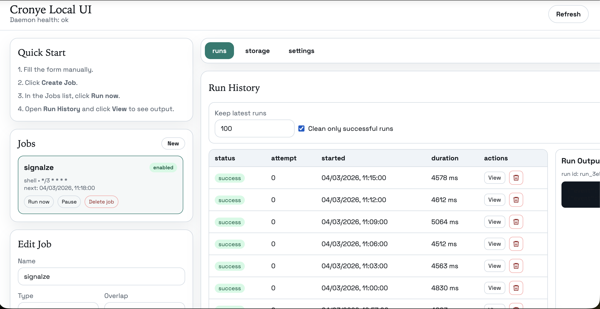

# Cronye

Run cron jobs locally on your Mac, no cloud, no subscriptions, with a clean web UI and reliable scheduling.

⭐ If this helps you, star the repo — and if you want to sponsor a lavender cream matcha at Starbucks, even better 😅

## Screenshot



## License

This project is open source under the [MIT License](./LICENSE).

## Product Goal

Reliable automations on your own machine, without cloud lock-in.

## MVP Scope

- Cron scheduling
- Startup catch-up for missed schedules after downtime
- Shell and webhook jobs
- Run logs, retries, retention, and cleanup controls
- Local web UI served from daemon
- Localhost API only by default

Non-goals in MVP:

- Drag-and-drop workflow builder
- Team collaboration
- Mobile runtime
- Deep AI agent features

## Architecture (MVP)

- Daemon: Go
- Scheduler: `robfig/cron/v3`
- API: `chi` on `127.0.0.1`
- Database: SQLite (WAL)
- UI: React + Vite + Tailwind (static assets served by daemon)
- Landing: Next.js (separate app)

## Repo Docs

- [Implementation blueprint](./docs/planning/implementation-blueprint.md)
- [MVP backlog](./docs/planning/mvp-backlog.md)
- [6-week delivery plan](./docs/planning/delivery-plan-6-weeks.md)
- [Launch checklist](./docs/ops/launch-checklist.md)
- [Local API contract](./docs/api/local-api.md)
- [SQLite schema](./docs/db/schema.sql)

## Repo Layout

- `daemon/` Go daemon and localhost API
- `ui/` local web app (Vite + React + Tailwind)
- `landing/` Next.js marketing site
- `docs/` implementation and launch docs

## Getting Started (Daemon)

```bash
cd daemon
go run ./cmd/daemon
```

Then check:

```bash
curl http://127.0.0.1:9480/health
```

## Quick Install (macOS Apple Silicon)

1. Open [Releases](https://github.com/deep1283/cronye/releases) and download the latest `cronye-macos.dmg`.
2. Drag `Cronye.app` to `Applications`.
3. Open `Cronye.app`.
4. If macOS blocks first launch, go to `System Settings -> Privacy & Security` and click `Open Anyway`.
5. Cronye starts locally and opens the UI at `http://127.0.0.1:9480`.

## Build Synced Release Bundle (UI + Daemon)

```bash
make release VERSION=0.1.0
```

This command:

- builds `ui/dist`
- runs daemon tests
- builds daemon binary with version ldflag
- bundles everything into `dist/release/<version>-<goos>-<goarch>/`

Bundle layout:

- `cronye-daemon` (or `.exe`)
- `ui/dist/*`
- `checksums.txt`
- `README-daemon.md`

Optional signed host build:

```bash
make release-signed VERSION=0.1.0 SIGNING_KEY_PATH=/abs/path/private.pem
```

Host target release-all helper:

```bash
make release-all VERSION=0.1.0
```

Cross-OS matrix helper (typically for CI with native runners):

```bash
make release-matrix VERSION=0.1.0
```

## Build macOS Installer DMG (Apple Silicon)

Create a user-facing installer (`Cronye.app` + drag-to-Applications DMG):

```bash
make package-macos-dmg VERSION=0.1.0
```

Output:

- `dist/release/0.1.0-darwin-arm64/cronye-macos.dmg`
- `dist/release/0.1.0-darwin-arm64/cronye-macos.dmg.sha256`

Notes:

- run this target on macOS
- this installer target currently supports Apple Silicon (`arm64`) only

## Service Commands

From a built daemon binary:

```bash
./cronye-daemon service install
./cronye-daemon service uninstall
```

## Performance Targets

- Idle RAM: < 80 MB
- Idle CPU: < 1%
- Startup: < 2 seconds
- Disk growth: < 100 MB/month by default

## Distribution

- Open-source and free to use.
- Current installer support: macOS Apple Silicon DMG.
